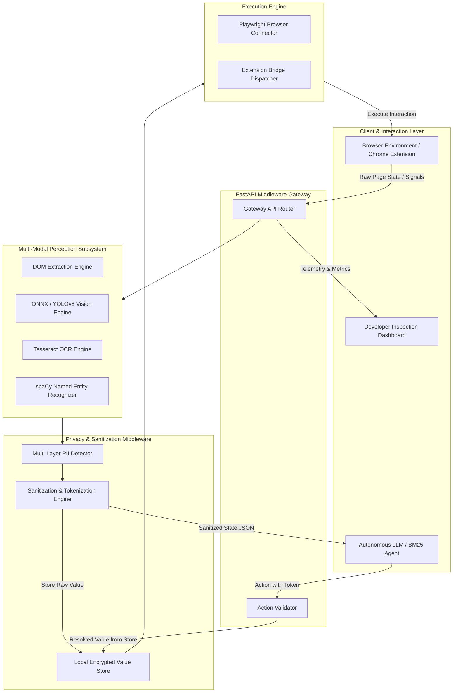
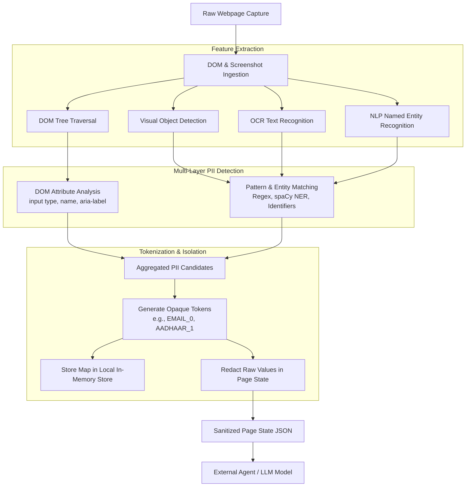
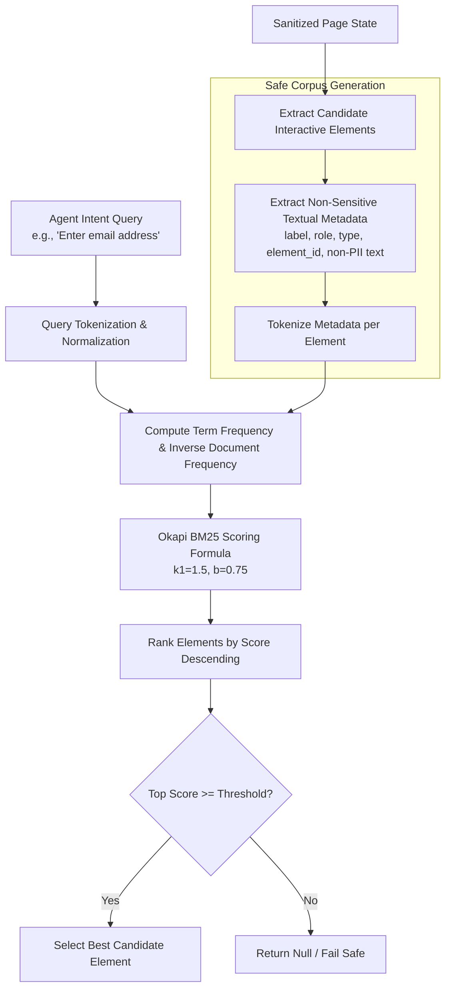
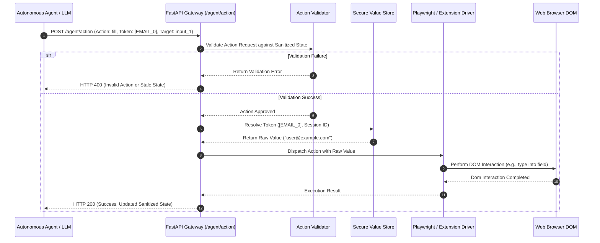
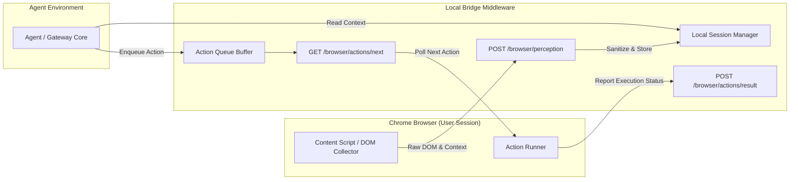

# Browser Perception


Autonomous web agents require detailed structural and visual understanding of browser interfaces to complete tasks. However, passing unredacted webpage state, raw DOM nodes, or unmasked screenshots to external language models presents severe privacy and security risks. 

This project delivers an on-device perception middleware that sits between the browser instance and the intelligent agent. The middleware extracts, detects, and redacts sensitive user data locally before sending sanitized interface representations to upstream models. When the agent issues action commands referencing opaque tokens, the local execution engine resolves the tokens back to their original values strictly at the execution boundary.

### Core Objectives
1. **Multi-Modal Feature Extraction**: Combine DOM structure, optical character recognition (OCR), visual object detection, and named entity recognition (NER) for comprehensive interface understanding.
2. **Zero-Trust Network Boundary**: Ensure raw sensitive data (PII, credentials, financial identifiers) never leaves the host machine.
3. **Tokenized Redaction & State Isolation**: Replace sensitive values with opaque structural tokens, maintaining local in-memory mappings for execution recovery.
4. **Deterministic Intent Ranking**: Utilize an Okapi BM25 ranking engine over non-sensitive metadata for precise, local element targeting.
5. **Validated Action Execution**: Verify agent action requests against active page state schemas prior to local browser dispatch.

---

## System Architecture

The middleware architecture is structured into isolated layers covering perception, privacy sanitization, intent ranking, and local action dispatching.



### Key Architectural Principles
- **Local Boundary Enforcement**: All PII detection algorithms and token stores operate strictly within the local process runtime.
- **Decoupled Gateway**: The FastAPI gateway exposes standardized REST endpoints for agent context querying and action submission.
- **Fail-Safe Fallbacks**: If vision, OCR, or NER models are unavailable, the system gracefully degrades to DOM-based extraction and deterministic regular expression filtering without throwing fatal runtime errors.

---

## Multi-Modal Perception Subsystem

The perception subsystem transforms raw webpage interfaces into structured, actionable domain models through four complementary analysis engines:

### 1. DOM Engine
- Performs recursive tree walks over accessible DOM elements.
- Identifies interactive nodes (inputs, buttons, anchor tags, select boxes, ARIA roles).
- Computes bounding client rectangles, accessibility attributes, node depth, and visible text content.

### 2. Computer Vision Engine (ONNX Runtime / YOLOv8)
- Analyzes rendered viewport screenshots to localize UI elements independently of DOM representation.
- Detects visual bounding boxes for custom-rendered buttons, icons, and non-standard control elements.
- Applies Non-Maximum Suppression (NMS) to eliminate duplicate detection candidates.

### 3. OCR Engine (Tesseract)
- Processes rendered screenshot regions to extract textual content embedded within images, canvas elements, or styled components.
- Correlates extracted text coordinates with DOM bounding boxes to verify element labels.

### 4. Named Entity Recognition Engine (spaCy)
- Analyzes natural language strings extracted from webpage text nodes.
- Identifies semantic entities including personal names, organization titles, geographic locations, and monetary values.

---

## Privacy & PII Detection Framework

The privacy layer employs a four-tiered detection methodology to ensure high sensitivity and low false-negative rates across global and regional data formats.

### Perception & PII Sanitization Flowchart



### Multi-Layer Detection Strategy

#### Layer 1: DOM Structural & Attribute Analysis
Analyzes HTML input element classifications and attribute metadata:
- `type="password"`, `type="email"`, `type="tel"`, `type="credit-card"`
- Attributes containing `autocomplete="cc-number"`, `aria-label="Social Security"`
- Field identifiers matching security keywords (`pin`, `cvv`, `secret`, `ssn`, `password`)

#### Layer 2: Deterministic Pattern & Regular Expression Matching
Executes compiled regular expressions against extracted text values for standard global and regional formats:

| Identifier Type | Matching Pattern / Schema | Example Target |
| :--- | :--- | :--- |
| **Email Address** | `[a-zA-Z0-9_.+-]+@[a-zA-Z0-9-]+\.[a-zA-Z0-9-.]+` | `user@organization.com` |
| **Global Phone Number** | `\+?\d{1,4}[-.\s]?\(?\d{1,3}\)?[-.\s]?\d{3,4}[-.\s]?\d{4}` | `+1-555-0199` |
| **Credit Card Number** | Luhn-validated digit sequences (13 to 19 digits) | `4532-XXXX-XXXX-8923` |
| **Aadhaar Number (India)** | `\d{4}[-\s]?\d{4}[-\s]?\d{4}` | `1234 5678 9012` |
| **PAN Card (India)** | `[A-Z]{5}[0-9]{4}[A-Z]{1}` | `ABCDE1234F` |
| **Indian Phone Number** | `(?:\+91[-.\s]?)?[6-9]\d{9}` | `+91 9876543210` |
| **IFSC Code (India)** | `[A-Z]{4}0[A-Z0-9]{6}` | `SBIN0001234` |
| **Driving License (India)** | `[A-Z]{2}[0-9]{2}[0-9]{11}` | `DL1420110012345` |

#### Layer 3: Semantic Named Entity Recognition
Uses spaCy statistical models to classify unstructured contextual text:
- `PERSON` entities -> Tokenized as `[PERSON_NAME_N]`
- `ORG` entities -> Tokenized as `[ORGANIZATION_N]`
- `GPE` entities -> Tokenized as `[LOCATION_N]`
- `MONEY` entities -> Tokenized as `[FINANCIAL_N]`

#### Layer 4: Visual & Spatial Correlation
Cross-references OCR text locations against detected PII regions to ensure values rendered within canvas or non-standard HTML elements are fully redacted in visual screenshots and DOM models.

### Tokenization and In-Memory Value Store
When sensitive data is identified:
1. The raw value is stored in a thread-safe, local in-memory `ValueStore` indexed by a cryptographically generated token (e.g., `[EMAIL_0]`, `[PASSWORD_1]`).
2. The raw value in the DOM state, text attributes, and input values is replaced with the token.
3. Screenshots are dynamically blurred over the bounding boxes of sensitive elements.
4. Only the tokenized `SanitizedPageState` is exposed to external agents.

---

## Information Retrieval & BM25 Element Ranking

To enable accurate, lightweight target element selection without requiring large generative models for simple interactions, the system includes an Okapi BM25 ranking engine.



### Mathematical Formulation
For a natural language intent query $Q$ consisting of keywords $q_1, q_2, \dots, q_n$, the Okapi BM25 score for an element document $D$ is calculated as:

$$\text{Score}(D, Q) = \sum_{i=1}^{n} \text{IDF}(q_i) \cdot \frac{f(q_i, D) \cdot (k_1 + 1)}{f(q_i, D) + k_1 \cdot \left(1 - b + b \cdot \frac{|D|}{\text{avgdl}}\right)}$$

Where:
- $f(q_i, D)$ is the term frequency of query token $q_i$ in the safe metadata corpus of element $D$.
- $|D|$ is the length of document $D$ in tokens.
- $\text{avgdl}$ is the average document length across all candidate elements on the page.
- $k_1 = 1.5$ (term frequency saturation parameter).
- $b = 0.75$ (document length normalization parameter).
- Inverse Document Frequency (IDF) is calculated as:

$$\text{IDF}(q_i) = \ln \left( \frac{N - n(q_i) + 0.5}{n(q_i) + 0.5} + 1 \right)$$

### Corpus Safety Guarantee
The BM25 corpus extractor strictly processes non-sensitive structural attributes (`label`, `type`, `role`, `element_id`, sanitized placeholder text). Redacted token strings and raw sensitive values are excluded from document indexing to prevent statistical leaking.

---

## Action Execution & Token Resolution Cycle

When an agent decides to interact with a page element, it sends an action payload containing element identifiers and value tokens back to the gateway.



### Action Validation Checks
Before execution, the `ActionValidator` verifies:
1. **Target Existence**: The specified `element_id` exists within the active page snapshot.
2. **Interactability**: The element is visible, enabled, and accepts the specified action type (e.g., preventing `fill` on non-input nodes).
3. **Token Ownership**: The submitted token exists in the active session's `ValueStore`.
4. **Origin Alignment**: Navigation requests match origin security policies.

---

## Chrome Extension & Local Integration Bridge

The architecture supports both direct Playwright browser control and live Chrome extension integration for user-driven sessions.



---

## Repository Structure

```
sih-1/
├── backend/
│   ├── actions/
│   │   ├── executor.py         # Playwright action execution engine
│   │   └── validator.py        # Action validation rules and safety checks
│   ├── agent_gateway/
│   │   ├── bm25_ranker.py      # Okapi BM25 implementation for UI elements
│   │   ├── mock_agent.py       # Deterministic BM25 mock agent
│   │   └── provider.py         # External LLM provider interfaces
│   ├── api/
│   │   └── gateway.py          # FastAPI server endpoints and CORS middleware
│   ├── browser/
│   │   ├── connector.py        # Async Playwright browser lifecycle manager
│   │   └── extension_bridge.py # Session bridge for live Chrome Extension
│   ├── capture/
│   │   └── service.py          # Multi-modal state capture coordinator
│   ├── config/
│   │   ├── logging.py          # Application logging setup
│   │   └── settings.py         # Pydantic configuration settings
│   ├── demo/
│   │   └── run_chrome_agent.py # End-to-end integration demo script
│   ├── models/
│   │   ├── domain.py           # Core Pydantic domain models
│   │   └── download_models.py  # Script for fetching ML model artifacts
│   ├── perception/
│   │   ├── dom_engine.py       # DOM tree extraction module
│   │   ├── ocr_engine.py       # Tesseract OCR extraction engine
│   │   └── vision_engine.py    # ONNX/YOLOv8 visual object detector
│   ├── pii/
│   │   └── detector.py         # Multi-layer PII detection suite
│   ├── sanitization/
│   │   └── engine.py           # Tokenization and redaction engine
│   ├── security/
│   │   ├── origin_policy.py    # URL origin validation policy
│   │   └── store.py            # Local thread-safe in-memory value store
│   └── tests/                  # Pytest automated test suites
├── dashboard/                  # Developer inspection dashboard (Next.js/React)
├── extension/                  # Manifest V3 Chrome Extension source
├── requirements.txt            # Python dependencies specification
├── main.py                     # Entry point for backend server execution
└── run_server.py               # Standalone server runner
```

---

## Installation & Setup Guide

### System Prerequisites
- **Python**: Version 3.10 or higher
- **Node.js**: Version 18.0 or higher (for the developer dashboard)
- **Tesseract OCR**: (Optional, for visual text extraction)
  - Ubuntu/Debian: `sudo apt-get install tesseract-ocr`
  - macOS: `brew install tesseract`
  - Windows: Install via Tesseract installer binary
- **Playwright System Dependencies**: Required for headless browser instances

### Step 1: Environment Setup

```bash
# Clone the repository
cd /path/to/sih-1

# Create and activate a virtual environment
python3 -m venv .venv
source .venv/bin/activate  # On Windows: .venv\Scripts\activate

# Install Python dependencies
pip install -r requirements.txt
```

### Step 2: Install Playwright Browsers and NLP Models

```bash
# Install Playwright browser binaries
playwright install chromium

# Download spaCy English NLP model (for NER PII detection)
python -m spacy download en_core_web_md
```

### Step 3: Configure Environment Variables (Optional)

Create a `.env` file in the root directory to override default settings:

```env
HOST=127.0.0.1
PORT=8000
LOG_LEVEL=INFO
BROWSER_HEADLESS=true
OCR_ENABLED=true
NER_ENABLED=true
PII_DETECTION_ENABLED=true
DEVICE=auto
```

---

## Server Execution & Operational Workflows

### 1. Launching the Backend API Gateway

```bash
# Start backend server via Uvicorn runner
python run_server.py

# Alternatively, run directly with Uvicorn CLI
python -m uvicorn backend.api.gateway:app --host 127.0.0.1 --port 8000 --reload
```

Verify backend health by querying the health endpoint:

```bash
curl http://127.0.0.1:8000/health
```

Expected Response:
```json
{
  "status": "healthy",
  "uptime_seconds": 12.4,
  "browser_status": "healthy",
  "version": "1.0.0"
}
```

### 2. Launching the Developer Inspection Dashboard

```bash
cd dashboard
npm install
npm run dev
```

Navigate to `http://localhost:3000` to inspect raw versus sanitized DOM elements, view processing latency metrics, monitor real-time server logs, and test perception triggers.

### 3. Running the Autonomous Chrome Agent Demo

```bash
python backend/demo/run_chrome_agent.py
```

---

## API Reference & Specifications

### 1. Capture Page Context
**Endpoint**: `POST /agent/context`

Captures the current browser state, applies multi-layer PII detection, stores raw values locally, and returns the tokenized page context.

#### Request Body
```json
{
  "task": "Log into user account and retrieve statement",
  "session_id": "optional_session_identifier"
}
```

#### Response Body (`200 OK`)
```json
{
  "task": "Log into user account and retrieve statement",
  "session_id": null,
  "page_revision": 1,
  "page": {
    "url": "https://example.com/login",
    "title": "Account Login",
    "elements": [
      {
        "element_id": "input_email_1",
        "type": "input",
        "role": "textbox",
        "label": "Email Address",
        "value": "[EMAIL_0]",
        "text": null,
        "is_sensitive": true,
        "is_interactive": true,
        "bbox": { "x": 100, "y": 200, "width": 300, "height": 40 }
      },
      {
        "element_id": "input_pass_2",
        "type": "password",
        "role": "textbox",
        "label": "Password",
        "value": "[PASSWORD_1]",
        "text": null,
        "is_sensitive": true,
        "is_interactive": true,
        "bbox": { "x": 100, "y": 260, "width": 300, "height": 40 }
      }
    ],
    "viewport": { "width": 1280, "height": 720 },
    "timestamp": 1724965200.0
  }
}
```

---

### 2. Execute Action
**Endpoint**: `POST /agent/action`

Validates and executes an action command on the browser instance. Resolves value tokens locally before DOM interaction.

#### Request Body
```json
{
  "action": "fill",
  "element_id": "input_email_1",
  "value_token": "[EMAIL_0]",
  "value": null,
  "url": null,
  "session_id": null,
  "page_revision": 1
}
```

#### Response Body (`200 OK`)
```json
{
  "success": true,
  "new_state": {
    "url": "https://example.com/login",
    "title": "Account Login",
    "elements": [],
    "viewport": { "width": 1280, "height": 720 },
    "timestamp": 1724965202.5
  },
  "error": null
}
```

---

### 3. Extension Ingress
**Endpoint**: `POST /browser/perception`

Receives raw page state captured by the Chrome extension, sanitizes it locally, and stores it in the active session bridge.

#### Request Body
```json
{
  "session_id": "chrome_session_88",
  "page": {
    "url": "https://example.com/portal",
    "title": "User Portal",
    "dom_elements": [],
    "screenshot_base64": null,
    "viewport": { "width": 1920, "height": 1080 },
    "timestamp": 1724965210.0
  }
}
```

#### Response Body (`200 OK`)
Returns the sanitized `SanitizedPageState` model.

---

## Security Specification & Threat Model

### Protected Boundaries
- **Network Data Leakage**: Raw PII values (passwords, emails, phone numbers, identity cards, credit cards) are tokenized before state representations exit the FastAPI gateway runtime.
- **Visual Privacy**: Rendered screenshots stored or transmitted to frontends undergo bounding-box redaction and blurring over sensitive form fields.
- **Untrusted Agent Isolation**: Upstream agents operate strictly on opaque tokens (`[TOKEN_N]`). Agents cannot read raw stored values.

### Residual Risk & Mitigation

| Threat Vector | Description | Recommended Production Mitigation |
| :--- | :--- | :--- |
| **Process Memory Forensics** | Raw sensitive values exist unencrypted in Python heap memory during active sessions. | Implement OS-level memory locking (`mlock`), encrypt the in-memory value store using AES-256-GCM, and shorten session retention periods. |
| **Logging Data Leakage** | Raw values or tokens logged to disk files could be exposed if log permissions are weak. | Enforce structural log scrubbers that strip token strings and prohibit raw parameter logging in production configurations. |
| **Bypass via Custom Canvas** | Non-standard graphical forms rendering text on HTML5 Canvas without ARIA tags. | Enable OCR visual detection layer for all page captures to catch non-DOM text nodes. |

---

## Testing & Quality Assurance

The codebase includes an automated test suite implemented using `pytest`.

### Executing Tests

```bash
# Run all unit and integration tests
pytest backend/tests/ -v

# Test specific subsystems
pytest backend/tests/test_comprehensive.py -v       # Comprehensive PII & Sanitization tests
pytest backend/tests/test_bm25_agent.py -v          # BM25 ranker & Mock Agent tests
pytest backend/tests/test_privacy_boundary.py -v    # End-to-end privacy boundary verification
pytest backend/tests/test_network_privacy.py -v     # Network isolation and token leakage tests
```

### Verified Scenarios
- **PII Detection Accuracy**: Validation across email, phone, SSN, Aadhaar, PAN, IFSC, and driving license schemas.
- **Zero Raw Value Transmission**: Verification that zero raw sensitive strings appear in exported state objects or API JSON payloads.
- **Token Resolution Correctness**: Verification that `ActionExecutor` resolves tokens to their correct raw values during browser interaction.
- **BM25 Ranking Accuracy**: Verification that natural language intent queries correctly resolve to target DOM elements.

---

## Performance Benchmarks

Latency and resource benchmarks measured on standard execution hardware (4-core CPU, 16GB RAM):

| Processing Phase | Average Latency | Bottleneck Source / Notes |
| :--- | :--- | :--- |
| **Playwright Screenshot Capture** | 180 ms - 350 ms | Headless browser frame buffer retrieval |
| **DOM Tree Traversal & Normalization** | 40 ms - 90 ms | DOM node extraction (scaled by node count) |
| **Multi-Layer PII Detection** | 30 ms - 80 ms | Parallel regex matching and attribute scanning |
| **spaCy NER Inference (Optional)** | 70 ms - 140 ms | CPU-based NLP inference |
| **Tesseract OCR Extraction (Optional)**| 200 ms - 450 ms | Image-to-text visual scan |
| **Tokenization & Sanitization** | 10 ms - 25 ms | In-memory token replacement and dictionary map |
| **BM25 Intent Selection** | 2 ms - 8 ms | Okapi BM25 scoring over candidate list |
| **Total Capture-to-Sanitized State** | **260 ms - 650 ms** | Standard DOM + Regex configuration |

### Memory Footprint
- **Base Runtime Process**: ~95 MB
- **Per Active Captured Snapshot**: +15 MB to 35 MB (DOM model + image buffers)
- **In-Memory Value Store**: < 1 MB for typical session execution (100-500 entries)

---

## Technical Stack & Dependencies

| Layer | Component | Technology / Library | License |
| :--- | :--- | :--- | :--- |
| **Backend API Gateway** | Web Server & Routing | FastAPI / Uvicorn | MIT |
| **Browser Driver** | Web Automation | Playwright for Python | Apache 2.0 |
| **NLP Subsystem** | Named Entity Recognition | spaCy (`en_core_web_md`) | MIT |
| **OCR Subsystem** | Optical Character Recognition | Tesseract / Pytesseract | Apache 2.0 |
| **Vision Inference** | Visual UI Detection | ONNX Runtime / OpenCV | MIT |
| **Information Retrieval**| Ranking Engine | Okapi BM25 (Custom Python) | MIT |
| **Data Validation** | Schema Enforcers | Pydantic v2 / BaseSettings | MIT |
| **Testing** | Test Automation | Pytest / Pytest-Asyncio | MIT |

---

## License

Browser Perception Middleware — Developed for Smart India Hackathon (SIH) 2026.
Distributed under the MIT License.
